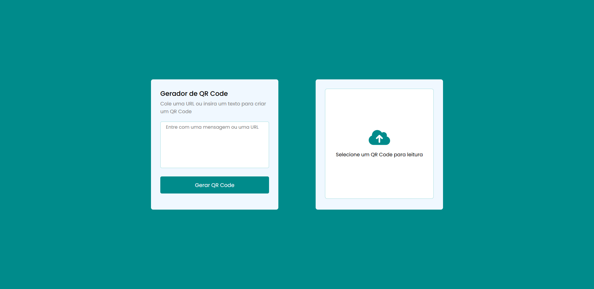

## Apresentação Geral

**Nome do Projeto:** QR Code Studio

**Descrição:**

QR Code Studio é uma ferramenta completa para a criação e leitura de QR Codes. Com esta aplicação, o usuário pode facilmente gerar imagens de 
QR Codes personalizadas e fazer o download das mesmas. Além disso, a ferramenta permite a leitura e decodificação de QR Codes já existentes, 
oferecendo uma solução prática e eficiente para todas as necessidades relacionadas a QR Codes.

- API: [QR code API](https://goqr.me/api/) 

**Objetivo:**

Implementar uma interface que permita a criação e leitura de qr codes.

**Tecnologias Utilizadas:**

## Contato

